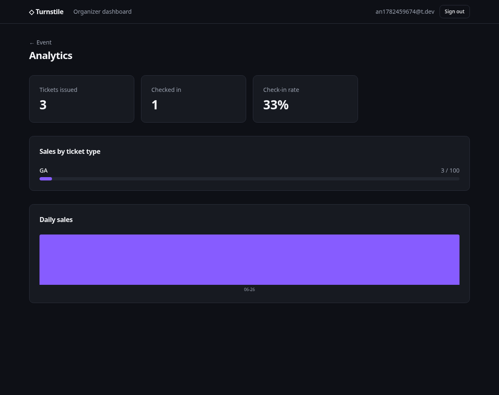
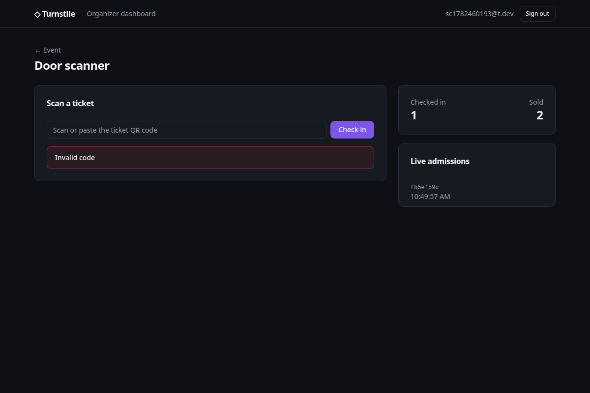
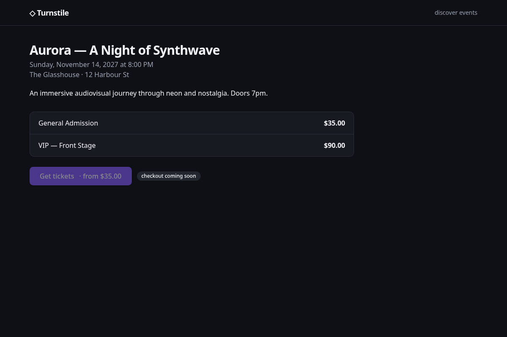
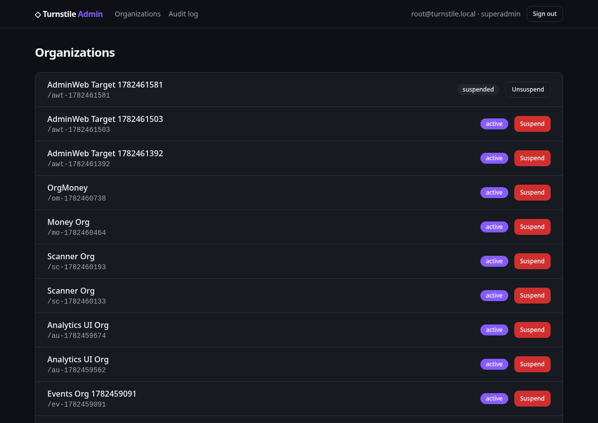
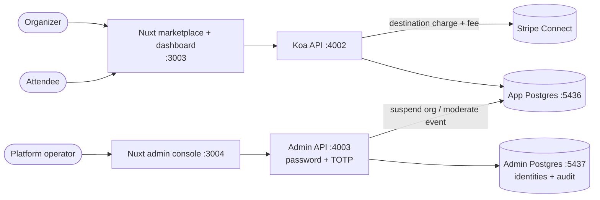

# Turnstile

> A **two-sided event-ticketing marketplace**. Organizations create events and sell tickets;
> attendees buy and get a signed QR pass; the platform onboards organizers via **Stripe Connect**
> and keeps a take-rate. Anti-oversell inventory, first-scan-wins door check-in, permission-based
> RBAC, and a **physically isolated admin control plane**.
>
> **Nuxt 3 + Koa 2 · Kysely + PostgreSQL · Stripe Connect · shadcn-vue + Tailwind.**

<p align="center">
  
  
</p>
<p align="center">
  
  
</p>

## What it demonstrates

A complete marketplace, built thin and typed end-to-end — but the interesting parts are the hard
ones a ticketing platform actually has to get right:

- **Anti-oversell under concurrency.** Inventory is claimed with a single atomic conditional
  `UPDATE … WHERE reserved + qty <= capacity` inside a transaction. 20 concurrent buyers on a
  5-seat tier → exactly 5 succeed, never 6. Promo-code and loyalty-point spends use the same guard.
- **Marketplace payments.** Stripe Connect (Express) **destination charges** route funds to the
  organizer and keep a 5% **application fee** as the platform take-rate. Runs keyless in dev via a
  mock payments adapter behind a `PaymentsProvider` interface.
- **Signed QR tickets + first-scan-wins check-in.** Each ticket is a JWT; the door scanner verifies
  it and admits via an atomic `UPDATE … WHERE status = 'valid'`, so a copied QR can't get two people
  in. A live SSE feed streams admissions to the dashboard.
- **Permission-based RBAC + audit.** Granular `resource:action` permissions (a compile-checked
  catalog, not a DB table) bundled into roles, a tenant-ownership guard, and an append-only audit log.
- **An isolated admin control plane.** The platform-operator side is a **separate service on a
  separate database** with its own credentials and **mandatory TOTP MFA** — so a breach of the app
  database can't reach admin identities or grant platform powers.
- **Money operations.** Full refunds (reversing transfer + application fee, returning inventory),
  promo codes, per-currency finance reconciliation, a loyalty points ledger, and affiliate
  attribution with commission.

## Architecture



The control plane holds credentials to *both* databases; the tenant API holds credentials to *only*
the app database. A dump taken with the app's credentials never sees admin identities or the
platform audit trail.

## Stack

| Layer | Choice |
| --- | --- |
| Web | **Nuxt 3** — SSR marketplace (SEO + JSON-LD) · CSR organizer dashboard · SPA admin console |
| UI | **shadcn-vue + Tailwind** (owned components, CSS-variable theming) |
| API | **Koa 2** — middleware onion: auth, RBAC, checkout, check-in (SSE) |
| DB | **Kysely + PostgreSQL 16** — typed SQL, no query can drift from the schema |
| Payments | **Stripe Connect** (Express; destination charges + application fee) |
| Auth | JWT httpOnly cookies · bcrypt · **RFC 6238 TOTP** (self-contained, unit-tested) |
| Validation | **Zod** (env + every request body) |
| Tooling | pnpm workspaces · Biome · Vitest · Husky · GitHub Actions CI |

## Monorepo layout

```
packages/core/     permission catalog + role bundles + pure authorization logic
apps/api/          Koa: auth, RBAC, orgs, events, ticketing, payments, check-in, money ops
apps/web/          Nuxt: public marketplace (SSR) + organizer dashboard (CSR)
apps/admin-api/    isolated control-plane service (separate DB, TOTP MFA)
apps/admin-web/    Nuxt SPA: the platform operator console
```

## Run it locally

```bash
pnpm install
cp .env.example .env
docker compose up -d postgres admin-postgres   # app :5436, admin :5437

# tenant side
pnpm --filter @turnstile/api migrate && pnpm --filter @turnstile/api dev   # :4002
pnpm --filter @turnstile/web dev                                           # :3003

# control plane (separate service + DB; prints a TOTP enrollment URI on first run)
pnpm --filter @turnstile/admin-api migrate && pnpm --filter @turnstile/admin-api dev  # :4003
pnpm --filter @turnstile/admin-web dev                                                # :3004
```

Payments run against the mock adapter unless `STRIPE_SECRET_KEY` is set, so the whole flow —
onboarding, checkout, refunds — is exercisable keyless.

## Verification

Every backend phase is proven against Postgres (atomic oversell, take-rate math, refund inventory
return, promo/loyalty caps, finance reconciliation); pure logic (permissions, TOTP, discounts,
commission) is unit-tested in CI. The web apps are driven end-to-end with Playwright — register →
create event → sell → scan, and admin MFA login → suspend → audit — against the built servers.

## License

MIT
